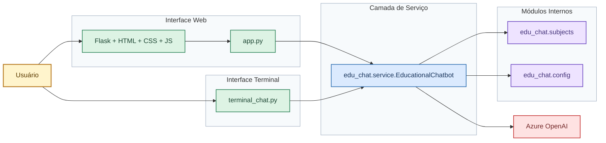

# Documentação Completa do Projeto

## Chatbot Educacional com Inteligência Artificial

**Disciplina:** Inteligência Artificial
**Professora:** Eliane Pozzebon
**Acadêmico:** Felipe Cidade Soares
**Data:** 22 de abril de 2026  

---

## Sumário

1. Apresentação do projeto
2. Contexto acadêmico e problema abordado
3. Objetivos
4. Escopo do projeto
5. Fundamentação teórica
6. Visão geral da solução desenvolvida
7. Arquitetura do sistema
8. Tecnologias utilizadas
9. Estrutura do projeto
10. Descrição detalhada dos módulos
11. Funcionamento do chatbot
12. Integração com Azure OpenAI
13. Interface e experiência do usuário
14. Modo quiz
15. Tratamento de erros, confiabilidade e boas práticas
16. Processo de desenvolvimento e decisões técnicas
17. Problemas encontrados e soluções adotadas
18. Testes e validação
19. Impacto acadêmico, técnico e prático
20. Limitações atuais
21. Melhorias futuras
22. Guia de instalação e execução
23. Conclusão
24. Referências

---

## 1. Apresentação do projeto

Este projeto consiste no desenvolvimento de um chatbot educacional com suporte de Inteligência Artificial, construído em Python, com foco em estudantes do ensino médio. A solução foi criada para responder perguntas de forma clara, objetiva e didática em disciplinas escolares, utilizando um modelo de linguagem de grande porte integrado ao Azure OpenAI.

O sistema oferece duas formas de uso:

- interface web, com foco em usabilidade, organização visual e experiência moderna;
- interface de terminal, para atender ao requisito mínimo da atividade e garantir simplicidade operacional.

O chatbot foi configurado para atuar em quatro disciplinas:

- Matemática
- Biologia
- História
- Física

Além disso, o sistema possui um modo quiz, no qual a IA deixa de apenas responder e passa a propor perguntas ao estudante, corrigindo e guiando o aprendizado de forma progressiva.

---

## 2. Contexto acadêmico e problema abordado

No processo tradicional de estudo, muitos alunos enfrentam dificuldades para tirar dúvidas pontuais fora do horário de aula. Mesmo quando o conteúdo está disponível em livros, apostilas ou anotações, o problema central costuma ser a falta de mediação pedagógica imediata. Em outras palavras, o aluno tem acesso à informação, mas nem sempre consegue transformá-la em entendimento.

Esse cenário abre espaço para o uso da Inteligência Artificial como apoio educacional. Um chatbot bem projetado pode:

- responder dúvidas com rapidez;
- adaptar a linguagem ao nível esperado para o ensino médio;
- reduzir a fricção no processo de revisão;
- ampliar a autonomia do estudante;
- simular um atendimento individualizado em larga escala.

Neste projeto, a proposta foi transformar um modelo de linguagem em um tutor virtual de apoio, com foco em explicação curta, didática e contextualizada.

---

## 3. Objetivos

### 3.1 Objetivo geral

Desenvolver um chatbot educacional em Python, integrado a um modelo LLM, capaz de responder perguntas sobre disciplinas do ensino médio com linguagem simples, objetiva e adequada ao contexto pedagógico.

### 3.2 Objetivos específicos

- criar uma aplicação funcional em Python;
- integrar a solução a um modelo de linguagem via Azure OpenAI;
- permitir a escolha de disciplinas específicas;
- garantir respostas curtas e didáticas;
- oferecer versão em terminal e versão web;
- adicionar um modo quiz para reforço de aprendizagem;
- aplicar boas práticas de organização de código;
- validar a solução com testes automatizados e verificações manuais.

---

## 4. Escopo do projeto

### 4.1 O que está dentro do escopo

- chatbot educacional com IA;
- suporte a quatro disciplinas;
- interface web com seleção de contexto;
- interface de terminal com encerramento por comando;
- integração com Azure OpenAI;
- configuração via `.env`;
- tratamento de erros de configuração e requisição;
- testes unitários básicos;
- documentação de uso e arquitetura.

### 4.2 O que está fora do escopo

- autenticação de usuários;
- armazenamento persistente de histórico em banco de dados;
- perfis personalizados por aluno;
- geração automática de boletim ou desempenho;
- upload de PDF ou TXT como base de conhecimento;
- integração com escola, LMS ou ambiente institucional;
- monitoramento em produção com telemetria avançada.

---

## 5. Fundamentação teórica

### 5.1 Inteligência Artificial no contexto educacional

A Inteligência Artificial, no contexto educacional, pode ser usada para ampliar acesso, personalizar explicações e acelerar a resolução de dúvidas. O valor não está apenas em “responder perguntas”, mas em tornar a resposta compreensível para o público-alvo.

No caso deste projeto, a IA atua como um mediador pedagógico complementar. Ela não substitui o professor, mas ajuda o estudante a revisar conteúdos, organizar raciocínio e reduzir bloqueios de aprendizagem.

### 5.2 LLM, ou Large Language Model

Um LLM é um modelo treinado em grandes volumes de texto para compreender instruções e gerar linguagem natural. Sua utilidade neste projeto está na capacidade de:

- interpretar perguntas em linguagem livre;
- adaptar a explicação ao contexto solicitado;
- reorganizar conhecimento em resposta curta e didática;
- conduzir interação em formato de conversa.

### 5.3 Engenharia de prompt

O comportamento de um LLM depende fortemente da instrução recebida. Por isso, este projeto utiliza prompts de sistema específicos para cada disciplina. Esses prompts orientam a IA a:

- responder em português do Brasil;
- manter foco no ensino médio;
- usar linguagem simples;
- ser curta e didática;
- corrigir erros conceituais com cuidado;
- usar exemplos práticos quando útil.

### 5.4 Modelos de raciocínio

O deployment utilizado no projeto é do tipo compatível com recursos de raciocínio. Isso significa que alguns parâmetros tradicionais de modelos de chat podem não ser suportados da mesma forma.

Fato: durante a validação real, o modelo respondeu com erro ao receber `max_tokens` e `temperature=0.2`.
Fato: a chamada passou a funcionar ao usar `max_completion_tokens`, e o modelo respondeu corretamente.
Inferência: o deployment está configurado em uma variante com restrições específicas de parâmetros.
Opinião técnica: adaptar o backend para alternar automaticamente entre formatos compatíveis foi a melhor solução, porque reduz risco de quebra e torna o sistema mais robusto.

---

## 6. Visão geral da solução desenvolvida

O sistema foi construído com uma arquitetura simples, modular e reutilizável. Em vez de misturar toda a lógica em um único arquivo, a solução foi dividida em camadas:

- camada de configuração;
- camada de domínio das disciplinas;
- camada de serviço de IA;
- camada de interface web;
- camada de interface terminal;
- camada de testes.

Essa separação melhora legibilidade, manutenção e escalabilidade.

### 6.1 Fluxo resumido

1. O usuário escolhe uma disciplina.
2. O sistema monta o contexto educacional correspondente.
3. A pergunta do usuário é enviada ao backend.
4. O backend prepara as mensagens e chama o Azure OpenAI.
5. A resposta é retornada ao frontend ou terminal.
6. O histórico recente é mantido para preservar contexto da conversa.

---

## 7. Arquitetura do sistema

### 7.1 Arquitetura lógica



### 7.2 Motivo da arquitetura escolhida

Fato: as interfaces web e terminal usam a mesma lógica central do chatbot.
Inferência: isso reduz divergência de comportamento e evita duplicação de regras.
Opinião técnica: essa decisão é superior a manter dois chatbots separados, porque reduz custo de manutenção, acelera evolução e diminui risco de inconsistência.

---

## 8. Tecnologias utilizadas

### 8.1 Linguagem principal

- Python 3.12

### 8.2 Backend

- Flask
- OpenAI Python SDK com suporte a Azure OpenAI
- python-dotenv
- cryptography, usada para HTTPS local com certificado ad-hoc no ambiente de desenvolvimento

### 8.3 Frontend

- HTML5
- CSS3
- JavaScript puro
- Jinja2 para renderização de templates no lado do servidor
- renderização local de Markdown para melhorar leitura das respostas

### 8.4 Recursos visuais

- imagens PNG para logo e ícones das disciplinas
- assets servidos pela pasta `static/`

### 8.5 Serviços externos

- Azure OpenAI

### 8.6 Testes

- unittest

---

## 9. Estrutura do projeto

```text
edu-chat/
|-- app.py
|-- terminal_chat.py
|-- requirements.txt
|-- README.md
|-- DOCUMENTACAO_PROJETO_IA.md
|-- edu_chat/
|   |-- __init__.py
|   |-- config.py
|   |-- service.py
|   |-- subjects.py
|-- templates/
|   |-- index.html
|-- static/
|   |-- css/
|   |   |-- style.css
|   |-- image/
|   |   |-- logo.png
|   |   |-- matematica.png
|   |   |-- microscopio.png
|   |   |-- livro.png
|   |   |-- einstein.png
|   |-- js/
|       |-- app.js
|-- tests/
|   |-- test_app.py
|   |-- test_subjects.py
|   |-- test_config.py
|   |-- test_service.py
|-- Backup/
```

### 9.1 Interpretação da estrutura

- `app.py`: ponto de entrada da interface web;
- `terminal_chat.py`: versão em terminal;
- `edu_chat/config.py`: leitura e validação das variáveis de ambiente;
- `edu_chat/subjects.py`: definição das disciplinas e dos prompts;
- `edu_chat/service.py`: comunicação com o Azure OpenAI;
- `templates/index.html`: estrutura visual da aplicação web;
- `static/css/style.css`: identidade visual e responsividade;
- `static/image/`: assets visuais usados na marca e nos ícones das disciplinas;
- `static/js/app.js`: comportamento do frontend;
- `tests/`: testes automatizados do projeto.

---

## 10. Descrição detalhada dos módulos

### 10.1 `edu_chat/config.py`

Responsável por:

- carregar variáveis do `.env`;
- validar campos obrigatórios;
- normalizar o endpoint do Azure;
- verificar consistência de `api-version` na configuração;
- centralizar parâmetros operacionais do chatbot.

Esse módulo foi importante para corrigir um problema real ocorrido durante a integração.

Fato: o endpoint havia sido configurado com a URL completa da rota, e não com a base do recurso.
Fato: isso causava erro `404 Resource not found`.
Fato: na versão atual, todas as variáveis críticas passaram a ser obrigatórias no `.env`, sem defaults silenciosos.
Opinião técnica: tratar isso no código foi melhor do que depender apenas de configuração manual perfeita, porque reduz risco operacional e evita execução com ambiente parcialmente inválido.

### 10.2 `edu_chat/subjects.py`

Responsável por:

- declarar as disciplinas disponíveis;
- associar cada disciplina a título, descrição, exemplos e tópicos de foco;
- gerar o prompt de sistema por disciplina;
- ativar instruções específicas do modo quiz.

Esse módulo concentra o “comportamento pedagógico” do chatbot.

### 10.3 `edu_chat/service.py`

É o núcleo da solução. Responsável por:

- construir o cliente `AzureOpenAI`;
- montar o histórico da conversa;
- enviar mensagens ao modelo;
- aplicar fallback de parâmetros compatíveis com diferentes tipos de deployment;
- tratar erros previsíveis com mensagens compreensíveis.

Esse módulo recebeu uma melhoria relevante para compatibilidade com modelos reasoning.

### 10.4 `app.py`

Responsável pela aplicação Flask e pelas rotas:

- `GET /` para carregar a interface;
- `GET /health` para verificação simples de saúde;
- `POST /api/chat` para processar mensagens do usuário;
- ativação opcional de HTTPS local por variável de ambiente.

Na versão atual, o arquivo também passou a:

- interpretar flags booleanas do ambiente de forma padronizada;
- habilitar `ssl_context="adhoc"` quando `FLASK_HTTPS=1`;
- validar previamente a presença da biblioteca `cryptography` para evitar erro obscuro ao subir o servidor.

### 10.5 `terminal_chat.py`

Permite:

- escolher a disciplina;
- ativar ou não o modo quiz;
- conversar pelo terminal;
- encerrar digitando `sair`.

Esse arquivo atende diretamente ao requisito mínimo da atividade.

### 10.6 `templates/index.html`

Contém a estrutura da interface, incluindo:

- sidebar;
- área de disciplinas;
- contexto atual;
- modo quiz;
- mensagens;
- campo de entrada;
- atalhos de perguntas iniciais.

### 10.7 `static/css/style.css`

Define:

- identidade visual;
- layout inspirado na referência enviada;
- contraste e hierarquia visual;
- rolagem da sidebar;
- comportamento responsivo em telas menores;
- encaixe visual de logos e ícones em formato de imagem.

### 10.8 `static/js/app.js`

Controla:

- seleção de disciplina;
- reinício de conversa ao mudar contexto;
- envio de perguntas;
- estado de carregamento;
- renderização dinâmica das mensagens;
- gerenciamento do modo quiz;
- interpretação de Markdown básico nas respostas exibidas no chat.

Também passou a tratar dois tipos de ícone:

- ícones textuais, como símbolos ou emoji;
- ícones por imagem, carregados da pasta `static/image/`.

Também passou a interpretar marcações comuns retornadas pelo modelo, como:

- `**negrito**`;
- `*itálico*`;
- `#`, `##` e `###`;
- listas com `-`, `*` e `1.`;
- código inline com crases.

Fato: antes dessa melhoria, a interface mostrava os caracteres de Markdown literalmente.
Opinião técnica: resolver isso no frontend foi a melhor opção porque melhora legibilidade sem aumentar dependências do projeto.

### 10.9 `static/image/`

Esta pasta concentra os assets visuais do projeto, incluindo:

- logo principal da aplicação;
- ícone de Matemática;
- ícone de Biologia;
- ícone de História;
- ícone de Física.

Essa organização foi necessária para seguir o padrão de arquivos estáticos do Flask e evitar erro de carregamento de imagem.

### 10.10 Testes automatizados

Os testes cobrem:

- carregamento de rotas principais;
- consistência das disciplinas;
- normalização de endpoint;
- leitura correta de configuração;
- estratégia de fallback para compatibilidade de modelos.

---

## 11. Funcionamento do chatbot

### 11.1 Entrada do usuário

O usuário pode:

- escolher a disciplina;
- escrever uma pergunta livre;
- usar sugestões prontas;
- ativar o modo quiz.

### 11.2 Construção do contexto

Ao receber a disciplina, o sistema carrega um prompt específico com:

- foco temático;
- tom pedagógico;
- regras de concisão;
- orientação para correção de erros conceituais;
- indicação de uso de exemplos cotidianos.

### 11.3 Uso do histórico

O chatbot mantém parte do histórico recente da conversa.

Fato: o histórico foi limitado aos itens mais recentes.
Inferência: isso controla custo e latência sem perder o contexto imediato.
Opinião técnica: esse equilíbrio é adequado para uma aplicação educacional interativa, em que o contexto recente importa mais do que um histórico extremamente longo.

### 11.4 Geração da resposta

Depois de montar as mensagens:

- o backend envia a conversa ao Azure OpenAI;
- o modelo gera a resposta;
- o texto é devolvido à interface;
- o frontend interpreta Markdown básico para melhorar a apresentação visual;
- a interação é adicionada ao histórico local da sessão.

---

## 12. Integração com Azure OpenAI

### 12.1 Variáveis utilizadas

O sistema espera, no mínimo:

```env
AZURE_OPENAI_API_KEY=...
AZURE_ENDPOINT=https://seu-recurso.cognitiveservices.azure.com
AZURE_DEPLOYMENT=gpt-5.3-chat
AZURE_API_VERSION=2025-04-01-preview
OPENAI_MODEL=gpt-5.3-chat
CHATBOT_TEMPERATURE=1
CHATBOT_MAX_TOKENS=350
CHATBOT_REASONING_EFFORT=minimal
```

Fato: na versão atual, todas essas variáveis devem estar explicitamente definidas no `.env`.
Inferência: erros de configuração passam a aparecer logo no carregamento, em vez de surgirem de forma tardia durante a execução.

Além das variáveis da integração com IA, o projeto também pode usar:

```env
FLASK_DEBUG=1
FLASK_HTTPS=1
PORT=5000
```

Uso:

- `FLASK_DEBUG`: ativa o modo de desenvolvimento do Flask;
- `FLASK_HTTPS`: habilita HTTPS local com certificado autoassinado;
- `PORT`: permite trocar a porta padrão do servidor.

### 12.2 Problema real de integração

Durante a integração, surgiram dois problemas importantes:

#### Problema 1, endpoint incorreto

O `AZURE_ENDPOINT` estava com uma URL completa de rota, incluindo `/openai/responses?...`.

Consequência:

- o SDK montava a URL final de forma inadequada;
- o Azure retornava `404 Resource not found`.

Solução adotada:

- normalização automática do endpoint para a base do recurso;
- leitura opcional da `api-version` presente na própria URL.

#### Problema 2, parâmetros incompatíveis com o deployment

Ao chamar `gpt-5.3-chat`, o modelo rejeitou:

- `max_tokens`
- `temperature=0.2`

Solução adotada:

- adoção de estratégia adaptativa em `service.py`;
- tentativa inicial com `max_completion_tokens` e `reasoning_effort`;
- fallback para parâmetros tradicionais apenas quando necessário.

### 12.3 Benefício da correção

Fato: a chamada real ao deployment passou a responder com sucesso após a adaptação.
Inferência: a integração agora está compatível com a configuração atual do recurso.
Opinião técnica: essa correção aumenta resiliência e reduz tempo de diagnóstico futuro, o que é relevante tanto em contexto acadêmico quanto em ambiente real.

---

## 13. Interface e experiência do usuário

### 13.1 Objetivo visual

O layout foi inspirado em uma interface escura, tecnológica e organizada, com forte contraste visual e foco em leitura.

### 13.2 Elementos principais da interface

- sidebar com identidade do projeto;
- lista de disciplinas;
- bloco de contexto atual;
- ativação do modo quiz;
- botão de limpar conversa;
- área principal para mensagens;
- sugestões iniciais de perguntas;
- composer de envio com suporte a `Enter` e `Shift+Enter`.

### 13.3 Sistema visual das disciplinas

Além do texto, a interface passou a usar identidade visual própria para as matérias:

- Matemática com ícone ilustrado específico;
- Biologia com microscópio;
- História com livro;
- Física com imagem temática.

Fato: inicialmente a interface misturava símbolos de texto e tentativas de caminho de imagem renderizadas como string.
Fato: o comportamento foi corrigido com renderização condicional no template e no JavaScript.
Opinião técnica: essa mudança melhorou consistência visual, reconhecimento rápido das disciplinas e sensação de acabamento profissional.

### 13.4 Correção de usabilidade realizada

Foi identificado que, em algumas resoluções de tela, a lista de disciplinas ficava parcialmente cortada.

Solução:

- a sidebar passou a ter rolagem interna;
- a scrollbar foi estilizada;
- as disciplinas deixaram de ficar inacessíveis.

Essa melhoria tem impacto direto em acessibilidade e uso real.

### 13.5 Melhoria de leitura das respostas

Foi identificado um problema de experiência do usuário nas respostas exibidas pelo chatbot.

**Sintoma:** elementos como `**negrito**`, `## títulos` e listas apareciam literalmente na interface.

**Causa:** o conteúdo era renderizado como texto puro no navegador.

**Solução:**

- implementação de renderização local de Markdown no JavaScript;
- escape prévio de HTML para reduzir risco de injeção de conteúdo;
- estilização específica no CSS para títulos, listas, negrito, itálico e código inline.

Impacto prático:

- melhora a clareza visual das respostas;
- reduz esforço de leitura do estudante;
- aumenta a percepção de qualidade e acabamento da interface.

---

## 14. Modo quiz

O modo quiz altera a função do chatbot.

Em vez de apenas explicar:

- a IA faz uma pergunta por vez;
- o aluno responde;
- o sistema corrige;
- a dificuldade pode ser ajustada conforme o desempenho.

### 14.1 Valor pedagógico

O quiz ativa recuperação ativa do conhecimento, o que tende a ser mais eficaz para fixação do que leitura passiva.

### 14.2 Valor técnico

Esse modo mostra que o projeto não é apenas um “chat livre”, mas uma ferramenta com intenção educacional mais estruturada.

---

## 15. Tratamento de erros, confiabilidade e boas práticas

### 15.1 Tratamento de configuração

O sistema valida:

- existência de chave;
- existência de endpoint;
- existência de deployment;
- existência explícita das variáveis operacionais obrigatórias;
- formato do endpoint;
- formato de parâmetros numéricos;
- validade do `reasoning_effort`.

Na versão atual, o projeto exige definição explícita de:

- `AZURE_OPENAI_API_KEY`;
- `AZURE_ENDPOINT`;
- `AZURE_DEPLOYMENT`;
- `AZURE_API_VERSION`;
- `OPENAI_MODEL`;
- `CHATBOT_TEMPERATURE`;
- `CHATBOT_MAX_TOKENS`;
- `CHATBOT_REASONING_EFFORT`.

Fato: não há mais defaults silenciosos para essas chaves.
Opinião técnica: isso reduz ambiguidade, acelera diagnóstico de falha e evita comportamento inesperado em demonstração ou uso real.

### 15.2 Tratamento de erros de inferência

O backend trata:

- mensagens vazias;
- erro de configuração;
- erro `404` do Azure;
- erros de compatibilidade de parâmetros;
- respostas vazias do modelo;
- exceções gerais de comunicação.

### 15.3 Logging

O projeto utiliza logs no backend para ajudar no diagnóstico de falhas.

### 15.4 Segurança

Boas práticas aplicadas:

- nenhuma chave foi escrita diretamente no código;
- credenciais permanecem no `.env`;
- configuração sensível fica desacoplada da lógica;
- o `.gitignore` evita versionamento de ambientes e `.env`.

### 15.4.1 HTTPS local em desenvolvimento

O projeto passou a suportar HTTPS opcional para testes locais.

Fato: quando `FLASK_HTTPS=1`, o Flask sobe com `ssl_context="adhoc"`.
Fato: esse modo depende da biblioteca `cryptography`.
Fato: o certificado é autoassinado, portanto o navegador exibe aviso de segurança.
Inferência: esse recurso é útil para validar comportamento sob HTTPS, por exemplo em cenários com APIs do navegador que exigem contexto seguro.
Opinião técnica: para desenvolvimento local, essa solução tem ótima relação entre simplicidade e valor prático. Para produção, o ideal continua sendo usar proxy reverso ou infraestrutura dedicada de TLS.

### 15.5 Manutenção

Fato: a lógica de negócio está separada da interface.  
Inferência: isso facilita troca futura de frontend, modelo ou estratégia de resposta.  
Opinião técnica: esse é um ponto forte do projeto, porque melhora sustentabilidade da solução ao longo do tempo.

### 15.6 Documentação interna do código

O projeto também foi fortalecido no aspecto de legibilidade técnica.

Fato: todas as funções Python ativas do projeto receberam docstrings detalhadas.
Fato: as funções principais do JavaScript da interface receberam comentários explicativos sobre intenção, parâmetros e fluxo.
Inferência: isso reduz curva de aprendizado para manutenção e melhora a qualidade da entrega acadêmica.
Opinião técnica: documentar o código-fonte não é apenas estética. Isso reduz risco operacional, facilita revisão pela professora e aumenta a clareza de decisão técnica.

---

## 16. Processo de desenvolvimento e decisões técnicas

### 16.1 Estratégia adotada

O projeto foi desenvolvido buscando:

- simplicidade;
- clareza;
- modularidade;
- usabilidade;
- compatibilidade com ambiente real.

### 16.2 Decisões importantes

#### Decisão 1, usar Flask em vez de Streamlit

Fato: era necessário entregar uma interface com visual mais próximo da referência.
Inferência: Streamlit limitaria o grau de controle visual.
Opinião técnica: Flask foi a melhor escolha, porque permitiu uma interface mais profissional, mais customizável e mais alinhada ao design desejado.

#### Decisão 2, criar duas interfaces sobre o mesmo núcleo

Fato: a atividade exigia terminal, mas a interface web agregaria valor.
Opinião técnica: atender aos dois cenários com a mesma lógica foi a solução mais eficiente.

#### Decisão 3, limitar histórico

Fato: histórico longo aumenta tokens, custo e latência.
Opinião técnica: limitar o histórico recente é uma decisão equilibrada para um chatbot didático.

#### Decisão 4, limpar conversa ao trocar disciplina

Fato: manter histórico de uma disciplina ao migrar para outra pode contaminar contexto.  
Opinião técnica: reiniciar a conversa foi a escolha correta para preservar coerência da resposta.

#### Decisão 5, usar assets visuais em `static/`

Fato: imagens fora da pasta `static/` não eram servidas automaticamente pelo Flask.
Inferência: isso gerava ícone quebrado ou tentativa de renderização de caminho como texto.
Opinião técnica: centralizar logo e ícones em `static/image/` foi a solução correta, porque segue a convenção do framework, simplifica caminhos e reduz erro de front-end.

#### Decisão 6, documentar profundamente o código

Fato: o projeto passou a incluir docstrings detalhadas nas funções Python e comentários técnicos no JavaScript.
Opinião técnica: essa decisão é especialmente importante em contexto acadêmico, porque mostra não apenas que o sistema funciona, mas que ele foi construído com preocupação de manutenção, legibilidade e transferência de conhecimento.

#### Decisão 7, interpretar Markdown no frontend

Fato: o modelo frequentemente retorna respostas com negrito, títulos e listas em Markdown.
Inferência: exibir isso como texto cru prejudica clareza pedagógica e sensação de qualidade.
Opinião técnica: implementar um parser local, simples e seguro, foi melhor do que adicionar uma dependência externa para um caso controlado e bem delimitado.

#### Decisão 8, adicionar HTTPS local opcional

Fato: alguns cenários de teste funcionam melhor em contexto seguro, com `https://`.
Inferência: depender apenas de HTTP local limita validações futuras e pode impedir testes de recursos do navegador mais restritivos.
Opinião técnica: ativar HTTPS por variável de ambiente foi a melhor escolha, porque mantém simplicidade no fluxo padrão e adiciona segurança sob demanda sem impor complexidade a todos os usos do projeto.

---

## 17. Problemas encontrados e soluções adotadas

### 17.1 Problema visual, disciplinas cortadas

**Sintoma:** a lista de disciplinas não cabia integralmente em algumas telas.
**Causa:** altura fixa da sidebar sem rolagem interna.
**Solução:** adição de `overflow-y: auto` e scrollbar estilizada.

### 17.2 Problema de integração, erro 404 no Azure

**Sintoma:** `404 Resource not found`.
**Causa:** endpoint configurado com caminho incorreto.
**Solução:** normalização automática do `AZURE_ENDPOINT`.

### 17.3 Problema de compatibilidade, parâmetros não suportados

**Sintoma:** erro de parâmetro incompatível.
**Causa:** deployment reasoning com restrições específicas.
**Solução:** fallback dinâmico entre estratégias de requisição.

### 17.4 Problema de exibição em terminal

**Sintoma:** erro de encoding ao imprimir caracteres Unicode.  
**Causa:** limitação de encoding do terminal Windows.  
**Solução:** validação com saída em `unicode_escape` durante o teste técnico.

### 17.5 Problema de renderização de imagens na interface

**Sintoma:** logo quebrado e caminho de imagem aparecendo como texto dentro das disciplinas.  
**Causa:** arquivos fora do padrão de `static` do Flask e renderização direta do valor `icon` como texto em vez de ``.  
**Solução:** reorganização dos assets em `static/image/`, uso de `url_for('static', ...)` no template, tratamento condicional para ícones visuais e ajuste do JavaScript para usar imagem também nos avatares da conversa.

### 17.6 Problema de renderização de Markdown nas respostas

**Sintoma:** marcações como `**`, `##` e listas apareciam literalmente na conversa.  
**Causa:** as mensagens eram exibidas como texto puro, sem conversão de Markdown para HTML.  
**Solução:** implementação de renderização local de Markdown com sanitização básica e estilização específica no CSS.

### 17.7 Problema de HTTPS local com certificado ad-hoc

**Sintoma:** ao ativar HTTPS local, o Flask encerrava a execução com erro relacionado a certificado ad-hoc.  
**Causa:** a biblioteca `cryptography` não estava instalada no ambiente virtual.  
**Solução:** inclusão de `cryptography` no `requirements.txt` e validação explícita no `app.py` para exibir mensagem clara quando a dependência estiver ausente.

---

## 18. Testes e validação

### 18.1 Testes automatizados

No momento da atualização desta documentação, foram executados **11 testes automatizados**, todos aprovados.

Esses testes validam:

- rotas principais;
- disponibilidade da página inicial;
- consistência das disciplinas;
- modo quiz;
- normalização de endpoint;
- leitura de configuração;
- fallback de parâmetros do modelo.

### 18.2 Validação manual

Também foram realizadas verificações manuais, incluindo:

- carregamento da interface web;
- troca de disciplina;
- exibição do contexto atual;
- renderização correta do logo e dos ícones das disciplinas;
- renderização correta de Markdown nas respostas do chat;
- envio de perguntas;
- funcionamento do modo quiz;
- limpeza de conversa;
- compatibilidade real com o deployment Azure configurado.

### 18.3 Importância da validação

Fato: uma aplicação pode passar em testes unitários e ainda falhar na integração real.
Fato: isso aconteceu na fase inicial do Azure.
Opinião técnica: a validação com chamadas reais foi essencial para transformar o projeto em algo funcional de verdade, e não apenas correto no papel.

---

## 19. Impacto acadêmico, técnico e prático

### 19.1 Impacto acadêmico

O projeto demonstra aplicação concreta de conceitos da disciplina de Inteligência Artificial:

- uso de LLM;
- engenharia de prompt;
- integração de API;
- projeto orientado a contexto;
- tratamento de falhas;
- adaptação de interface para experiência do usuário.

### 19.2 Impacto técnico

O sistema mostra que uma IA útil depende de mais do que chamar um modelo. Foi necessário resolver:

- configuração de ambiente;
- padronização de entradas;
- compatibilidade de parâmetros;
- design de UX;
- modularidade;
- testes;
- robustez.

### 19.3 Impacto prático

Em um cenário real, uma solução como esta pode:

- reduzir tempo gasto pelo aluno para tirar dúvidas simples;
- ampliar disponibilidade de apoio fora do horário de aula;
- aumentar eficiência do estudo individual;
- diminuir carga de dúvidas repetitivas em contextos educacionais;
- escalar atendimento sem crescimento linear de custo humano.

---

## 20. Limitações atuais

Apesar de funcional, o projeto ainda possui limitações:

- não salva histórico persistente;
- não possui login;
- não mede desempenho do aluno;
- não gera relatórios de uso;
- não usa base documental externa;
- não identifica nível do estudante de forma personalizada;
- depende de conexão com Azure OpenAI;
- não possui testes end-to-end de navegador.

Fato: essas limitações não impedem o uso acadêmico da solução.
Inferência: elas se tornam mais relevantes em produção institucional.
Opinião técnica: para um projeto de disciplina, o escopo atual está bem resolvido, mas há espaço claro para evolução.

---

## 21. Melhorias futuras

As evoluções mais relevantes seriam:

- persistir histórico por sessão ou usuário;
- adicionar painel de desempenho e progresso;
- permitir upload de PDF e TXT como base de conteúdo;
- incluir mais disciplinas;
- permitir seleção de dificuldade;
- registrar métricas de uso;
- criar autenticação;
- adicionar banco de dados;
- aplicar testes automatizados de frontend;
- disponibilizar deploy em nuvem.

### 21.1 Melhorias com maior retorno

Opinião técnica: as três melhorias com maior retorno prático seriam:

- persistência de histórico;
- base de conhecimento com arquivos;
- analytics de uso e desempenho.

Motivo:

- aumentam valor pedagógico;
- melhoram continuidade do estudo;
- permitem tomada de decisão baseada em uso real.

---

## 22. Guia de instalação e execução

### 22.1 Pré-requisitos

- Python 3.12 ou superior
- acesso a um recurso Azure OpenAI configurado
- deployment de modelo disponível
- arquivos de imagem presentes em `static/image/`
- dependências instaladas, incluindo `cryptography` quando houver uso de HTTPS local

### 22.2 Criação do ambiente virtual

```powershell
python -m venv venv
```

### 22.3 Ativação do ambiente virtual

```powershell
.\venv\Scripts\Activate.ps1
```

### 22.4 Instalação das dependências

```powershell
python -m pip install -r requirements.txt
```

### 22.5 Configuração do `.env`

Exemplo:

```env
AZURE_OPENAI_API_KEY=SUA_CHAVE
AZURE_ENDPOINT=https://seu-recurso.cognitiveservices.azure.com
AZURE_DEPLOYMENT=gpt-5.3-chat
AZURE_API_VERSION=2025-04-01-preview
OPENAI_MODEL=gpt-5.3-chat
CHATBOT_TEMPERATURE=1
CHATBOT_MAX_TOKENS=350
CHATBOT_REASONING_EFFORT=minimal
FLASK_DEBUG=1
FLASK_HTTPS=0
```

### 22.6 Execução da interface web

```powershell
python app.py
```

Depois, acessar:

```text
http://localhost:5000
```

Observação importante:

- o Flask serve automaticamente os assets da pasta `static/`;
- por isso, logos e ícones do projeto devem permanecer em `static/image/`.

### 22.6.1 Execução com HTTPS local

Para subir o projeto com HTTPS no ambiente local, defina no `.env`:

```env
FLASK_HTTPS=1
```

Depois, execute normalmente:

```powershell
python app.py
```

E acesse:

```text
https://localhost:5000
```

Observações:

- o navegador exibirá aviso de certificado, porque o certificado é autoassinado;
- esse comportamento é esperado em desenvolvimento local;
- em produção, a recomendação continua sendo usar HTTPS por infraestrutura própria, como proxy reverso ou serviço gerenciado.

### 22.7 Execução da interface terminal

```powershell
python terminal_chat.py
```

### 22.8 Execução dos testes

```powershell
python -m unittest discover -s tests -v
```

---

## 23. Conclusão

O projeto atingiu com sucesso o objetivo de construir um chatbot educacional com Inteligência Artificial, funcional, organizado e aplicável ao contexto do ensino médio. A solução foi além do requisito mínimo ao incluir:

- interface web com boa experiência visual;
- múltiplas disciplinas;
- modo quiz;
- validação real com Azure OpenAI;
- tratamento de problemas de compatibilidade;
- testes automatizados;
- identidade visual com ícones por disciplina;
- documentação interna detalhada do código;
- documentação estruturada.

Mais importante do que simplesmente “usar IA”, este projeto demonstra entendimento de como transformar um modelo de linguagem em um sistema utilizável, confiável e orientado a um propósito educacional.

Fato: a aplicação está funcional e validada tecnicamente.
Inferência: o projeto tem potencial de evolução para contextos mais amplos de apoio educacional.
Opinião técnica: para a disciplina de Inteligência Artificial, esta entrega é consistente porque combina teoria, integração prática, resolução de problemas reais e preocupação com usabilidade.

---

## 24. Referências

### 24.1 Referências técnicas do projeto

- Código-fonte local do projeto `edu-chat`
- Estrutura de módulos em Python criada neste trabalho
- Testes automatizados desenvolvidos para validação da solução

### 24.2 Referências externas oficiais

- Microsoft Learn, Azure OpenAI reasoning modelshttps://learn.microsoft.com/en-us/azure/foundry/openai/how-to/reasoning
- Microsoft Learn, Azure AI Services Deployments List REST API
  https://learn.microsoft.com/en-us/rest/api/aiservices/accountmanagement/deployments/list?view=rest-aiservices-accountmanagement-2024-10-01

---

## Encerramento

Documento elaborado para fins acadêmicos na disciplina de Inteligência Artificial, contemplando análise técnica, arquitetural, funcional e aplicada do projeto de chatbot educacional desenvolvido em Python com integração a Azure OpenAI.
